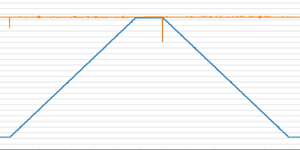
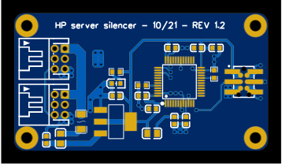
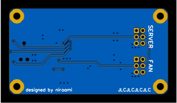
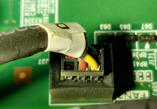

# HP server silencer

 

Inpired by the *many* other projects to silence the HP DL380e/p - but without most of the jank.  
Don't get me wrong, I love Arduino and projects that anyone can do themselves on a budget, but I just wanted something more robust. Something I could trust won't fail and somehow take the server with it. Something that is plug & play, and could be produced in bulk if needed (for relatively cheap).

I believe **this** is that something. The premise is quite simple. This STM32 equipped board acts as a middle man between the server & each fan. It takes the PWM signal from the server, scales & limits it to some user-configureable value and passes is along to the fan.

# How it works
Here is a quick example of the boards fan curves in action. They are user configureable (i might even make a little configuration tool, so that you don't have to write configs manually.. if i feel motivated enough), but what you are seeing is the default curve that I've made as a good 'starting point'.  
I personally don't think it needs or should be changed, but I guess there are use cases where I can see both a *more* and *less* agressive curve make sense.

The **green curve is the input**. I've just got another STM32 producing a PWM signal @25kHz, that linearly sweeps the duty cycle from 0 to 100%, waits, and then back.  
The **red curve is the target** PWM. This is generated by the STM32 to control the fans.

Right now, you can manually configure the "fan curve" in [`curves.h`](src/Core/Src/curves.h).

Both of these values on the graph are after being smoothed/filtered via a rolling average. This average is produced by taking the last *n* samples (8 by default), or max. of last *t* milliseconds of data (400ms by default). What this means is that no data older than 400ms is taken into account for the average, and a maximum of last 8 values are.  
This technique gets rid of some of the signal uncertainty, but might not solve all of the issues that there are with scaling input values to different ranges - and also *maybe* introduces it's own artifacts, but none of those actually show up on my logic analyzer in a meaningful way, so it might just be issues with the STM32CubeMonitor polling rate or whatever.

Here are the values before any post processing is applied (on the left) and after (on the right).

# Design
All of the PCB design files can be found in the [pcb](pcb/) folder, but also on [OSHW](https://oshwlab.com/niraami/hp-server-silencer). 

I designed it from scratch in EasyEDA, and it has currently gone through 2 revisions. I've split them up using the EasyEDA versioning system, so you can check them out if, for whatever reason, you'd want...

The design is quite simple, as it just consists of 2 JST PHD 2.0 connectors, some power circuity, a STM32F103 (like in the bluepill) and a debugging header. All of the logic processing is done by the MCU, which is even more simplified by it's powerful PWM input & output capabilities. There are some quirks, but at least I didn't have to deal with counting the pulses myself or something.

To power the STM32, an AMS117-3.3 LDO piggibacks on the 12V coming from VCC - as the MCU requires literally milliamps of current, this shouldn't be an issue. I've chosen an LDO to simplify the programming & debugging, as it can also be powered off of 5V (from a USB port for example).

## Fan PWM sense
The PWM Sense pins between the input & output connectors are connected - but it would be possible to reroute them, and use another STM32 timer to generate fake fan speed information for the server. The current server firmware version I've got doesn't seem to care about the reported speed much though, so I didn't implement that.

# Inspiration
Inspired by the many other HP fan "silencing" projects, but especially the [Max-Sum/HP-fan-proxy](https://github.com/Max-Sum/HP-fan-proxy) project. Though don't just blindly trust somebody's work, check it yourself... for example, I found that the the displayed [connector pinout](#motherboard-fan-pinout) doesn't match my server (and didn't check until the v1.0 of my board arrived :P).

These are just a *few* of the projects I came across while researching this topic. It seems that this series of server is quite notorious on [r/Homelab](https://www.reddit.com/r/homelab) for being so loud, people will try **literally** anything to make it shut up.
- [Silencing the HP Dl380, For Good.](https://www.reddit.com/r/homelab/comments/beuks5/silencing_the_hp_dl380_for_good/)
- [HP DL380p Arduino Fan Mod](https://www.reddit.com/r/homelab/comments/ny2eia/hp_dl380p_arduino_fan_mod_standby_question_and/)
- [Silence of the fans: Controlling HP server fans with a modified iLO4. And MORE!](https://www.reddit.com/r/homelab/comments/di3vrk/silence_of_the_fans_controlling_hp_server_fans/)
- [HP DL380P G8 fan noise with bios hack](https://www.reddit.com/r/homelab/comments/f94b0e/hp_dl380p_g8_fan_noise_with_bios_hack/)
- [Faking the fan signal on a DL380 G7](https://www.reddit.com/r/homelab/comments/72k3jf/faking_the_fan_signal_on_a_dl380_g7/)

# Sources
- [Max-Sum/HP-fan-proxy](https://github.com/Max-Sum/HP-fan-proxy)
- [STM32 Variable PWM Signal Output with timers, Keil Arm-mdk and Stm32cubemx ide](https://www.engineersgarage.com/stm32-variable-pwm-with-timers/)
- [Phil’s Lab - KiCad STM32 Hardware Design and JLCPCB Assembly](https://www.youtube.com/watch?v=t5phi3nT8OU)

# Part alternatives/not listed in BOM
- [50mm PHD2.0 JST cable (2x3P) - store 1](https://www.aliexpress.com/item/1005001346032672.html)
- [50mm PHD2.0 JST cable (2x3P) - store 2](https://www.aliexpress.com/item/1005002904897807.html)
- [JST PHD2.0 compatible 90˚ connector - alt 1](https://www.ebay.com/itm/PHD2-0-2-0mm-Pin-Header-PCB-Connector-Socket-Buckle-3-10P-Right-Angle-Various/153429645789)
- [JST PHD2.0 compatible 90˚ connector - alt 2](https://lcsc.com/product-detail/Wire-To-Board-Wire-To-Wire-Connector_HR-Joint-Tech-Elec-A2211WR-2X03P_C338851.html)
- [Tag-Connect - TC2030-IDC-NL-10](https://www.tag-connect.com/product/tc2030-idc-nl-10-6-pin-plug-of-nails-spring-pin-cable-with-0-1-ribbon-connector-10-version)
- [Tag-Connect - ARM20-CTX 20-Pin to TC2030-IDC Adapter for Cortex](https://www.tag-connect.com/product/arm20-ctx-20-pin-to-tc2030-idc-adapter-for-cortex)
- [USB connector to power the board while uploading firmware](https://www.aliexpress.com/item/4001198319430.html)

# Rants/stories

## Fan connectors
The connector type was very difficult to figure out, as it looks to be a proprietary 2.00mm pitch, 6 pin (2x3) keyed connector. And of course, HP will not just sell it to you, or even give you some datasheet for it.    
Luckily, Max's project was a very useful starting point, as Max found a compatible alternative, in the form of a JST PHD 2.0. Though, at first he wrote it to be a PH 2.0, but after much searching, I've found out that the D in PHD stands for "double row", and thus corrected him [here](https://github.com/Max-Sum/HP-fan-proxy/issues/4).

The above screenshot is from a document which you can find [here](https://jst.de/uploads/product_overview/JST%20Product%20Overview_JD09.pdf) and a local copy at [docs/JST Product Overview_JD09.pdf](docs/JST%20Product%20Overview_JD09.pdf).

Not that just knowing the part number is going to do you much good.. it's a very rare one, barely anyone sells it, and crimping obscure JST's often requires special (and expensive) tools. But luck struck once again, and I managed to find a seller on AliExpress that has [super short PHD2.0](https://www.aliexpress.com/item/1005001346032672.html)'s in the 2x3 (6 pin) form!  
*In case that listing dissapears in the ether, here is at least the name:*  **5CM 26AWG 50MM PHD2.0 JST 2.0mm Pitch PHD PHDR-10VS 10 PIN Connector Wire Harness 2.0MM pitch 50MM double**

One more catch! I swear it's the last one ;)  
The connector doesn't fit into the header on the motherboard due to the small guides on the sides. But the plastic is soft enough, that with a steady hand and a sharp knife, they can be cut off really easily.

## Motherboard fan pinout
Max's documentation provides a [very similar diagram](https://raw.githubusercontent.com/Max-Sum/HP-fan-proxy/master/images/post-8123-0-98784900-1394609613.png) to what I've got below, but we, for whatever reason, have the GND & NC pins swapped. There isn't even a cable there for me, so maybe there are some differences between server batches.. I've got no idea. So just in case, check what kind of a pinout your server has

Here is a "corrected" pinout, along with pictures of how the cable wires look (their colors do make a bit of sense):

## The server/fans use an inverted PWM signal
So yeah, I was very confused when plugging in my board that is meant to make the server more quiet, but instead it went full tilt. After a bit of headscratching, and using one of the prototype boards as a breakout, I figured out that what the ILO reports as 66%, is actually 33% duty cycle on the PWM.  
In STM32 terms, this is called PWM polarity, and should be set to `low`.

Luckily this required just 2 lines in the code to change, but nevertheless, it was quite funny.

